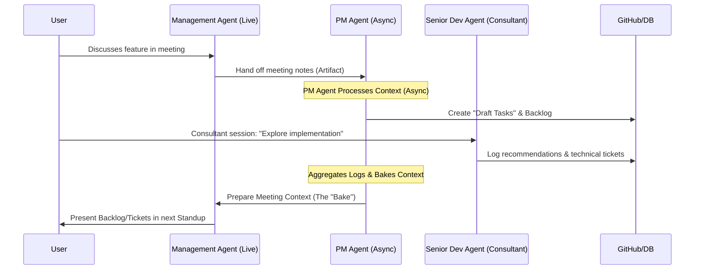

# Agent Specialization & ETL Technical Specification

This document defines the Extract, Transform, Load (ETL) pipeline and the operational boundaries for the Engineering Orchestration Framework's specialized agents.

## 1. The Orchestration ETL Pipeline

The ETL pipeline maintains the **Project Knowledge Graph**, enabling a shared state across disparate agent interfaces.

### A. Extraction (Ingestion)
-   **GitHub Webhooks:** Real-time triggers for PRs, pushes, and issue comments.
-   **Meeting Streams:** Audio/text capture from Gemini Live sessions.
-   **Internal DB (PostgreSQL):** Historical velocity, user profiles, and decision logs.
-   **GitHub MCP:** Direct codebase/documentation interrogation for deep context retrieval.

### B. Transformation (Synthesis)
The **Agno framework** orchestrates the hand-off and state transitions:
1.  **Semantic Mapping:** Correlating code changes to meeting-derived requirements.
2.  **Constraint Validation:** Checking new tasks against security/scalability logs from the Senior Dev Agent.
3.  **Prioritization Scoring:** Weighted ranking based on Business Value, Technical Debt, and Deadline Proximity.

### C. Loading (Persistence)
-   **GitHub API:** Creation of "Draft Issues" and Kanban cards.
-   **Context Baking:** Preparing artifact-rich prompts for the next Management Agent session.
-   **State Persistence:** Updating the Knowledge Graph to reflect current project reality.

---

## 2. Agent Scopes & Operational Boundaries

### A. Senior Dev Agent (The "Codebase Consultant")
*Active only during user-initiated sessions for deep technical exploration.*
-   **Nature:** Session-based / One-time consultant.
-   **Responsibilities:**

    -   Navigate complex documentation, API references, and DB schemas.
    -   Audit specific modules for edge cases (CORS, state handling).
    -   **Ticket Recommendation:** Issues recommendations or "technical tickets" during the conversation (supervised by the user).
-   **Input:** Full codebase (MCP), Documentation, DB Schema, User Queries. 
-   **Output:** Technical logs, recommended tickets, remediation code snippets.

### B. PM Agent (The "Async Worker")
*The engine of the framework; operates in the background on event/schedule triggers.*
-   **Nature:** Event-driven / Scheduled worker.
-   **Responsibilities:**
    -   **Context Digestion:** Monitors GitHub issues, Kanban state, and Senior Dev logs.
    -   **Task Baking:** Prepares "Next Meeting" context for the Management Agent.
    -   **Auto-Aggregation:** Consolidates unreviewed tasks/tickets into a "Daily Digest." //elaborate this, what is daily digest, what does it do and why is it important.
    -   **Lifecycle:** Can create backlogs but does *not* auto-resolve or update existing tasks to "Done" unless explicitly prompted. //explicitly define what it can do and its scope in relation to the kamban/tasks board (CRUD)
-   **Input:** Multi-source context (GitHub, Meeting notes, Senior Dev logs).
-   **Output:** Draft backlogs, baked meeting context, daily digests.

### C. Management Agent / Scrum Master (Gemini Live)
*The human-facing interface for meetings and synchronization.*
-   **Nature:** Live facilitator / Non-async.
-   **Responsibilities:**
    -   Facilitate "Daily Standups" via voice (Gemini Live).
    -   Present baked artifacts (tasks/blockers) prepared by the PM Agent.
    -   Redirect team focus toward sprint goals and resolve live blockers.
-   **Input:** "Baked" context from the PM Agent, Real-time voice interaction.
-   **Output:** Meeting summaries, task assignments (sent to PM Agent for loading).

---

## 3. Interaction Workflow: The "Triage" Cycle

### The Workflow Steps:
1.  **Ingestion:** Intent is captured during a live session (Management Agent).
2.  **Drafting:** The PM Agent (Async) digests the meeting artifact and creates draft issues.
3.  **Consultation:** The User optionally engages the Senior Dev Agent to refine the implementation strategy; SD logs technical "tickets" of recommendation.
4.  **Refinement:** The PM Agent aggregates GitHub context and SD logs, calculates priorities, and "bakes" the context for the next meeting.
5.  **Presentation:** The Management Agent presents the refined, artifact-rich backlog in the next standup for final human approval.
