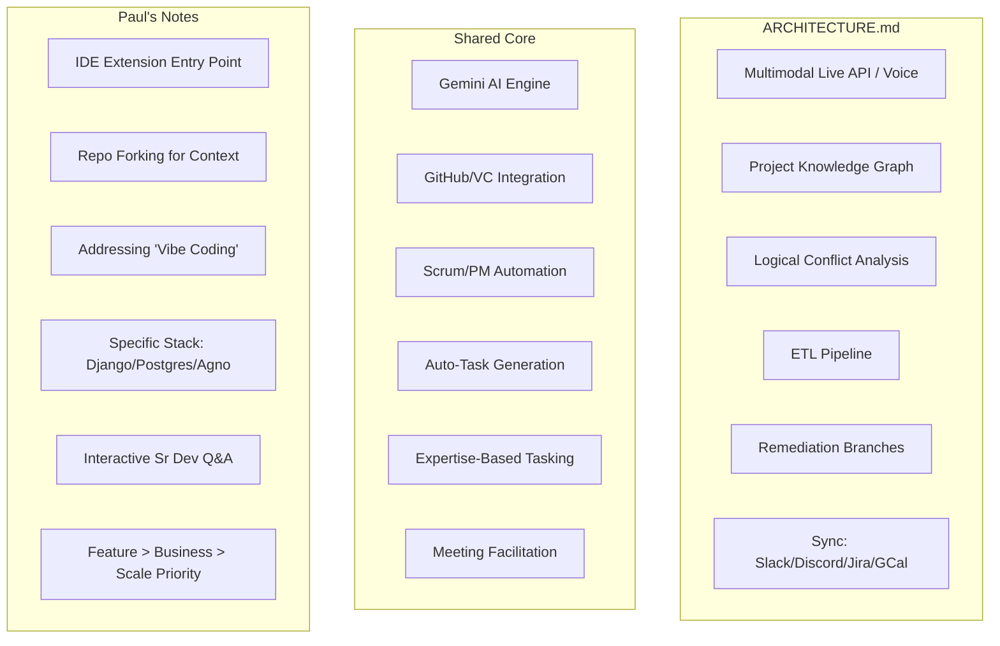

# Venn Diagram Analysis: Project Frameworks

This document analyzes the core similarities and differences between the **Engineering Orchestration Framework** (`ARCHITECTURE.md`) and the **Senior Dev/PM Hackathon App** (`paul notes on hackathon.md`).

## 1. Visual Overview (Mermaid)

## 2. Detailed Comparison

### Core Similarities (The Overlap)
- **Gemini-Powered:** Both systems utilize Gemini AI as the core reasoning engine.
- **SCM Integration:** Deep reliance on GitHub/Version Control for metadata and code analysis.
- **Project Management Automation:** Both aim to eliminate manual Scrum overhead (ranking tasks, managing backlogs).
- **Human-in-the-Loop (HITL):** Both position the AI as an "Advisory Agent" or "Assistant" rather than a replacement for leads.
- **Context-Aware Distribution:** Tasks are assigned based on developer profiles, expertise, and historical ownership.

### Unique to ARCHITECTURE.md (Enterprise Orchestration)
- **Multimodal Interaction:** Heavy emphasis on **Gemini Live** for real-time voice moderation of meetings.
- **Systemic Integration:** Bridges the gap between **logistical tools** (Google Calendar, Jira) and **communication tools** (Slack, Discord).
- **Architectural Oversight:** Focuses on **Logical Conflicts** (interface mismatches between branches) and **Remediation Branches**.
- **Data Infrastructure:** Employs a formal **ETL Pipeline** and **Project Knowledge Graph** to maintain cross-domain state.

### Unique to Paul's Notes (Developer-Centric Tool)
- **Developer Workflow:** Includes an **IDE Extension** for "one-click" project checks and **Repo Forking** for agent sandboxing.
- **"Vibe Coding" Correction:** Specifically designed to force developers to consider Security, Scalability, and Business Fit.
- **Conversational Interrogation:** The "Senior Dev Agent" asks pointed questions (e.g., "Did you implement CORS?") to uncover gaps.
- **Defined Tech Stack:** Specifies a concrete implementation (Django, Agno, PostgreSQL, Vercel/Render).
