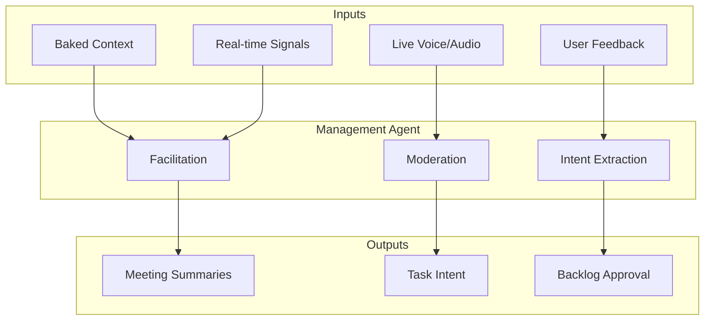

# Building Management Agent

## Overview
The Management Agent (Scrum Master / Gemini Live agent) is the real-time interaction layer of the Engineering Orchestration Framework. It facilitates project synchronization via a custom-hosted scrum meeting platform, utilizing the Gemini Multimodal Live API for low-latency voice and multimodal engagement.

## Roles and Responsibilities
- **Meeting Facilitation:** Conducts "Daily Standups" and tactical synchronization meetings via voice on our proprietary platform.
- **Moderation & Direction:**
    - **Time-Boxing:** Enforces agenda limits.
    - **Topic Relevance:** Prevents scope creep during live sessions.
    - **Goal Alignment:** Redirects focus to the critical path.
    - **Issue Resolution:** Ensures every blocker has a clear owner and next step.
- **Project Oversight (Enumerated):**
    - **Team Interaction:** Acts as the bridge between engineering leads and individual contributors.
    - **Blocker Identification:** Detects verbal signals of friction or technical debt.
    - **Deliverable Tracking:** Monitors the status of PRs and commits relative to sprint targets.
- **Artifact & Context Presentation:** Presents a hybrid of "baked" historical data and live operational signals, including:
    - **Draft Task Backlog:** New issues derived from previous meetings, cross-referenced with the current Kanban state.
    - **Live Project Status:** Real-time visibility into the project timeline, Kanban board health, and Google Calendar availability.
    - **Issue & Action Logs:** Live streams of repository activity and GitHub Actions status to identify immediate build failures or deployment blockers.
    - **Daily Digests:** Aggregated summaries of unreviewed tasks and repository activity, generated by the PM Agent's auto-aggregation logic to reduce notification fatigue.
    - **Test Plan Drafts:** High-level verification steps generated by the framework upon PR submission or feature branch creation. These ensure that every new feature has a clear path to "Done" based on its technical delta.
    - **Remediation Suggestions:** Logical conflict warnings or architectural pattern deviations detected during code ingestion.
- **Sprint Management:**
    - **Goal Parameters:** Tracks progress against critical health metrics:
        - **Sprint Velocity:** The aggregate rate of "Definition of Done" achievement, adjusted for task complexity.
        - **Milestone Deadlines:** Proximity of current progress to hard-coded delivery targets.
        - **Definition of Done (DoD):** Compliance validation to ensure tasks meet quality and architectural standards before being closed.
    - **Resource Alignment:** Recommends focus shifts based on identified bottleneck categories:
        - **Bandwidth Bottlenecks:** Mismatches between developer availability and task load.
        - **Technical Bottlenecks:** Dependencies on unresolved blockers or mounting technical debt.
        - **Process Bottlenecks:** Stalls in the review pipeline or unaddressed "Daily Digest" items.

## Contextual Flow (Input/Process/Output)

## Input/Output Detail
- **Input:** 
    - **"Baked" Context:** Scoped to GitHub issues, Kanban state, current Sprint, Milestones, and Google Calendar.
    - **Live Interaction:** Real-time multimodal signals from the team.
- **Output:**
    - **Meeting Summaries:** Structured records of decisions and consensus.
    - **Intent Capture:** Handoff of newly identified tasks to the PM Agent.
    - **Refined Backlog:** Finalized task lists ready for engineering execution.

## Technical Strategy
- **Low Latency:** Powered by Gemini Flash for responsive live interactions.
- **Context Scoping:** Meetings are strictly focused on project management; technical deep-dives are deferred to the Senior Dev Agent to preserve the live context window.
